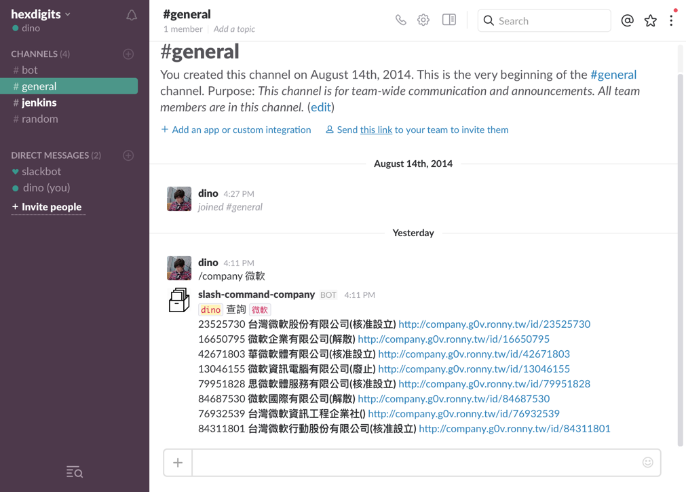

# SlashCompany

SlashCompany 是一個以 Azure Functions 實作的 Slash Command 服務端點，功能為查詢經濟部商業司的公司登記資料，後端使用 g0v 所提供的公開 API，感謝 g0v 的無私奉獻，提供優質服務。

關於 Slash Command 的相關設定，請參考[官方說明頁](https://get.slack.help/hc/en-us/articles/201259356-Using-slash-commands)。

在建立 Slash Command 在 Url 欄位中填入 Function 的 Url (包含 key) 即可。

## Screenshoot

